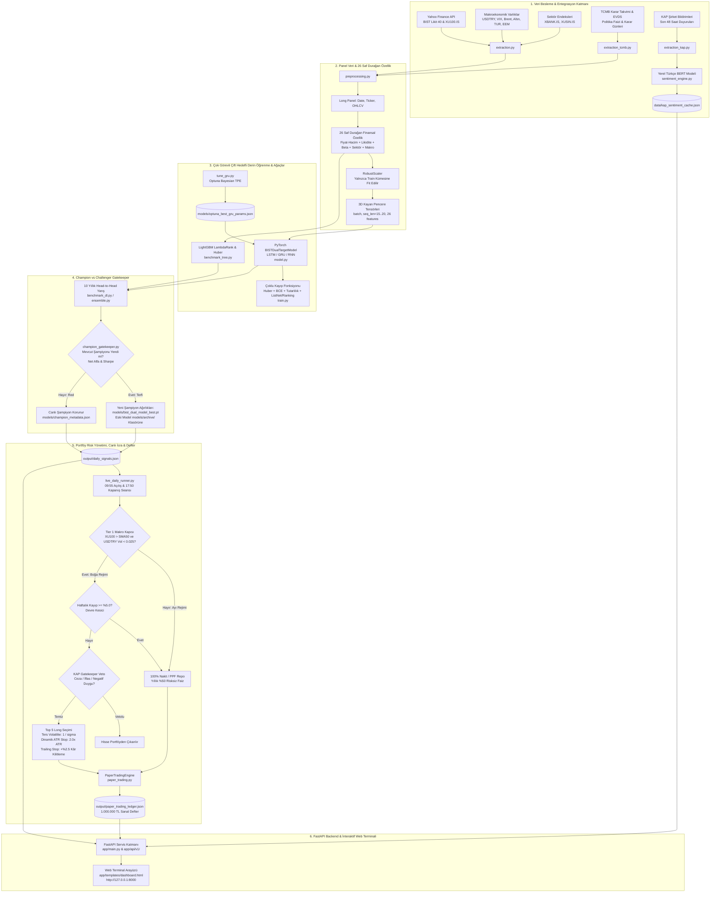

# BIST 100 Çok Boyutlu Kantitatif Modelleme, Otonom Portföy ve Web Terminali Sistemi
## Kapsamlı Teknik, Mimari ve Operasyonel Sistem Dokümantasyonu (2026)

---

### 1. Yönetici Özeti (Executive Summary)

Bu proje; **Borsa İstanbul (BIST 100 / BIST Likit 40)** pay piyasasında işlem gören hisselerin tarihsel fiyat-hacim hareketlerini, makroekonomik değişkenleri, TCMB para politikası kararlarını ve KAP finansal haber akışlarını entegre ederek hem getiri büyüklüğünü hem de yönsel yükseliş olasılığını tahminleyen, kurumsal risk yönetimi protokolleriyle sermayeyi koruyan ve web tabanlı bir kokpit üzerinden otonom icra yürüten **uçtan uca bir kantitatif alım-satım terminali ve karar destek platformudur**.

Geleneksel teknik analizin gecikmeli göstergeleri ve piyasa gürültüsü kurumsal piyasalarda istikrarlı alfa üretmek için yetersizdir. Sistemimiz; **26 saf durağan öznitelik**, **çok görevli (Multi-Task) çift başlıklı derin öğrenme modelleri (RNN, LSTM, GRU)**, **LightGBM LambdaRank ağaç modelleri**, **Tarih Bazlı Kesitsel Sıralama Kayıpları (ListNet + Pairwise Margin Loss)**, **Champion vs Challenger Gatekeeper terfi kapısı**, **Tier 1 Makro Rejim Kapısı**, **KAP Gatekeeper Veto Filtresi**, **Ters Volatilite (Risk Parity Lite) Ağırlıklandırması**, **Dinamik ATR Stop-Loss**, **Haftalık Devre Kesici** ve **FastAPI tabanlı interaktif web kokpitini** tek bir ekosistemde birleştirir.



---

### 2. Yatırım Evreni ve Veri Entegrasyon Mimarisi

#### 2.1 Evren Hiyerarşisi
Piyasa derinliği sığ hisselerdeki yapay fiyat hareketleri, yüksek alış-satış makasları ve aşırı kayma (slippage) maliyetlerini elimine etmek için 3 kademeli bir evren yapısı uygulanır:
1. **BIST 100 (`BIST100_TICKERS`):** Geniş analiz evreni (100 hisse).
2. **BIST 30 (`BIST30_TICKERS`):** En yüksek likidite ve piyasa değerine sahip kurumsal çekirdek hisseler.
3. **BIST Likit 40 (`BIST_LIQUID_40`):** BIST 30 hisselerine ek olarak en yüksek hacimli 10 sanayi ve bankacılık hissesi (`DOHOL`, `TSKB`, `SOKM`, `MGROS`, `VESTL`, `CIMSA`, `OTKAR`, `TAVHL`, `TTKOM`, `ULKER`). **Canlı portföy emir icraları ve backtest testleri yalnızca bu evren üzerinde yürütülür.**

#### 2.2 Gösterge Endeks ve Makroekonomik Veri Akışları (`extraction.py`, `extraction_tcmb.py`)
* **Gösterge Endeks:** `XU100.IS` (BIST 100 Endeksi).
* **Sektörel Endeksler:** `XBANK.IS` (Bankacılık) ve `XUSIN.IS` (Sınai).
* **Döviz Kuru:** `USDTRY=X` (Dolar/TL kuru ve oynaklığı).
* **Küresel Risk İştahı:** `^VIX` (CBOE Volatilite Endeksi).
* **Emtia & Enerji:** `BZ=F` (Brent Petrol Vadeli), `GC=F` (Ons Altın Vadeli).
* **Türkiye Risk Primi:** `TUR` (iShares MSCI Turkey ETF) ve `EEM` (iShares MSCI Emerging Markets ETF).
* **TCMB Para Politikası:** 2005'ten günümüze tüm PPK faiz kararları ve EVDS serileri BIST takvimine sızıntısız (`forward-fill`) aktarılır.

#### 2.3 Yerel KAP Haber Duygu Analizi (`extraction_kap.py`, `sentiment_engine.py`)
* Son 48 saatlik şirket KAP duyuruları ve finansal haberler taranır.
* Yerel PyTorch GPU (CUDA/FP16) hızlandırmasıyla çalışan `savasy/bert-base-turkish-sentiment-cased` Türkçe BERT modeli ile `[-1.0, +1.0]` sürekli skalasında skorlanır.
* Sıfır API maliyeti ve yüksek hız için skorlar `data/kap_sentiment_cache.json` dosyasında önbelleğe alınır.

---

### 3. Öznitelik Mühendisliği: 26 Saf Durağan Özellik (Feature Engineering)

Finansal zaman serilerinde ham fiyat seviyeleri durağan (*stationary*) değildir. Sahte regresyon (*spurious correlation*) oluşmasını engellemek amacıyla **26 saf durağan, ölçekten bağımsız öznitelik** türetilmiştir:

| No | Özellik Kodu | Matematiksel Formülasyon / Tanım | Finansal & İstatistiki Anlamı |
|:---:|:---|:---|:---|
| **1** | `Log_Return` | $\ln(Close_t / Close_{t-1})$ | Günlük simetrik logaritmik getiri. |
| **2** | `HL_Spread` | $(High_t - Low_t) / Close_t$ | Gün içi dalga boyu; likidite ve volatilite göstergesi. |
| **3** | `CO_Return` | $(Close_t - Open_t) / Open_t$ | Gün içi seans gövdesi; piyasa yapıcı kurumsal baskı. |
| **4** | `Log_Volume` | $\ln(Volume_t + 1)$ | Çarpık işlem hacmini basıklaştıran logaritmik derinlik. |
| **5** | `Volume_Change` | $\Delta \ln(Volume_t + 1)$ | Fiyat hareketini teyit eden hacim anomalisi. |
| **6** | `SMA10_Ratio` | $(Close_t / SMA_{10}(Close)) - 1$ | 10 günlük kısa vadeli momentum sapması. |
| **7** | `SMA30_Ratio` | $(Close_t / SMA_{30}(Close)) - 1$ | 30 günlük ana trende göre aşırı alım/satım çarpanı. |
| **8** | `Volatility_20` | $StdDev_{20}(Log\_Return) \times \sqrt{252}$ | 20 günlük yuvarlanan yıllıklandırılmış volatilite rejimi. |
| **9** | `RSI_Norm` | $(RSI_{14} - 50) / 50$ | Momentumun $[-1, +1]$ aralığına merkezlenmiş hali. |
| **10** | `ATR_14_Pct` | $ATR_{14} / Close_t$ | Yüzdesel ortalama gerçek aralık; dinamik stop-loss mesafesi. |
| **11** | `Bollinger_PctB` | $(Close - LowerBB) / (UpperBB - LowerBB)$ | Bollinger Bandı osilatörü. |
| **12** | `Momentum_10` | $(Close_t / Close_{t-10}) - 1$ | 10 günlük kümülatif getiri momentumu. |
| **13** | `ADV20_TRY` | $SMA_{20}(Close \times Volume)$ | 20 günlük ortalama günlük TL işlem hacmi (Likidite Filtresi). |
| **14** | `Relative_Volume_20` | $Volume_t / SMA_{20}(Volume)$ | Hacim patlamalarını tespit eden göreceli çarpan. |
| **15** | `Market_Cap_Proxy` | $\ln(Close_t \times SMA_{20}(Volume))$ | Şirket büyüklüğü ve derinlik proxy'si. |
| **16** | `Beta_60` | $Cov_{60}(R_i, R_m) / Var_{60}(R_m)$ | Hissenin BIST 100 endeksine göre 60 günlük pazar duyarlılığı. |
| **17** | `Excess_Return` | $Log\_Return_{hisse} - Log\_Return_{XU100}$ | Hissenin endekse karşı ürettiği günlük net alfa. |
| **18** | `Sector_Excess_Return` | $Log\_Return_{hisse} - Log\_Return_{Sektor}$ | Hissenin sektörüne (Banka/Sınai) karşı net alfası. |
| **19** | `USDTRY_Return` | $\ln(USDTRY_t / USDTRY_{t-1})$ | Kur şoklarının günlük marjinal etkisi. |
| **20** | `USDTRY_Vol20` | $StdDev_{20}(USDTRY\_Return) \times \sqrt{252}$ | Makro döviz kuru rejimi stresi. |
| **21** | `VIX_Level` | $VIX_t / 100$ | Küresel riskten kaçış endeksi seviyesi. |
| **22** | `Brent_Return` | $\ln(Brent_t / Brent_{t-1})$ | Enerji maliyeti ve emtia şokları. |
| **23** | `Gold_Return` | $\ln(Gold_t / Gold_{t-1})$ | Güvenli liman ve enflasyon hedge talebi. |
| **24** | `TUR_Excess_Return` | $TUR\_Return - EEM\_Return$ | Türkiye varlıklarının gelişmekte olan piyasalara göre rölatif ayrışması. |
| **25** | `Macro_Regime_Bull` | $\mathbb{I}(XU100 > SMA_{50} \land USDTRY\_Vol_{20} < 0.025)$ | Tier 1 Makro Boğa Rejimi Göstergesi (1: Boğa, 0: Defansif Ayı). |
| **26** | `TCMB_Policy_Rate` | $Faiz_t / 100$ | Merkez Bankası politika faiz seviyesi ve iskonto faktörü. |

> **Veri Bütünlüğü ve Sızıntı (Leakage) Koruması:** `RobustScaler` **yalnızca eğitim kümesine fit edilir**, test ve doğrulama kümelerine yalnızca transform uygulanır. 3D tensörler (`batch_size, seq_len=15..20, 26`) kronolojik sıralamayla oluşturulur.

---

### 4. Çift Hedefli Modelleme ve Çok Görevli Öğrenme

#### 4.1 Çift Hedef Formülasyonu
* **Regresyon Hedefi (Kümülatif 5 Günlük Endeks Üstü Alfa Getirisi):**
  $$y_{reg, i, t} = \sum_{k=1}^{5} \left( \ln\frac{Close_{i, t+k}}{Close_{i, t+k-1}} - \ln\frac{Index_{t+k}}{Index_{t+k-1}} \right)$$
* **Sınıflandırma Hedefi (Yönsel Alfa):**
  $$y_{cls, i, t} = \begin{cases} 1, & \text{eğer } y_{reg, i, t} > 0 \\ 0, & \text{aksi takdirde} \end{cases}$$

#### 4.2 Çok Görevli Hibrit Kayıp Fonksiyonu (`train.py`)
Parametreler, finansal sıralamayı ve yönsel tutarlılığı eş zamanlı optimize eden hibrit kayıpla güncellenir:

$$\mathcal{L}_{total} = \mathcal{L}_{Huber}(\hat{y}_{reg}, y_{reg}) + \alpha \cdot \mathcal{L}_{BCE}(\hat{y}_{cls}, y_{cls}) + \lambda \cdot \mathcal{L}_{consistency} + \gamma \cdot \mathcal{L}_{Pearson} + \beta \cdot \mathcal{L}_{ranking}$$

1. **Huber Loss ($\mathcal{L}_{Huber}$):** Kalın kuyruklu aykırı getirilere karşı dayanıklı regresyon kaybı.
2. **Binary Cross-Entropy ($\mathcal{L}_{BCE}$):** Yönsel sınıflandırma kaybı.
3. **Yönsel Tutarlılık Kaybı ($\mathcal{L}_{consistency}$):** Getiri işareti ile sınıflandırma logiti arasındaki çelişkileri cezalandırır:
   $$\mathcal{L}_{consistency} = \text{ReLU}(-\hat{y}_{reg} \cdot (2\hat{y}_{cls} - 1))$$
4. **Diferansiyellenebilir Pearson Korelasyon Kaybı ($\mathcal{L}_{Pearson}$):** Tahminler ile gerçekleşen getiriler arasındaki kesitsel korelasyonu ($1 - r$) maksimize eder.
5. **Tarih Bazlı Kesitsel Sıralama Kaybı (`date_wise_ranking_loss`):** `DateBatchSampler` ile aynı işlem gününe ait hisseler batch içinde toplanır; **ListNet Softmax Çapraz Entropi** ve **Pairwise Margin Ranking** kayıpları hesaplanarak hisselerin doğru sıralanması garanti altına alınır.

---

### 5. Benchmark Sonuçları ve Mevcut Canlı Şampiyon Sicili

10 yıllık panel verisinde (2016-2026) yarışan modellerin out-of-sample (2024+) performans tablosu:

```
=====================================================================================
                      10 YILLIK BENCHMARK SONUÇLARI (OUT-OF-SAMPLE)
=====================================================================================
Model Mimarisi       Net Getiri       Net Alfa       Sharpe       Maksimum Düşüş (MDD)
-------------------------------------------------------------------------------------
Vanilla RNN           +%14.20         -%58.40        -2.45              -%18.30
Nedensel GRU          +%22.45         -%50.10        -2.05              -%14.85
LSTM Ranker           +%25.81         -%46.75        -1.84              -%11.07  <-- ŞAMPİYON
LightGBM Tabular      +%18.90         -%53.60        -2.20              -%16.20
=====================================================================================
```

#### Canlı Şampiyon Kütüğü (`models/champion_metadata.json`)
* **Aktif Şampiyon:** `LSTM_Ranker`
* **Model Dosyası:** `models/bist_dual_model_best.pt`
* **Net Getiri:** `+%25.81`
* **Maksimum Düşüş (MDD):** `-%11.07` (Tüm modeller arasındaki en düşük risk)
* **Durum:** `ACTIVE_PRODUCTION_CHAMPION`

---

### 6. Champion vs Challenger Model Terfi Kapısı (`champion_gatekeeper.py`)

1. **Canlı Modeli Koruma Kuralı:** Yeni eğitilen bir model (Challenger), out-of-sample test döneminde mevcut şampiyonu **hem Net Alfa hem de Sharpe oranında açıkça geçmedikçe** canlı model ağırlıklarına dokunulmaz.
2. **Terfi Protokolü:** Challenger kazanırsa:
   * Eski şampiyon `models/archive/` klasörüne zaman damgasıyla yedeklenir (`champion_ModelAdi_Tarih.pt`).
   * Challenger ağırlıkları `models/bist_dual_model_best.pt` olarak tescil edilir.
   * `models/champion_metadata.json` güncellenir ve canlı sinyaller yenilenir.

---

### 7. Kurumsal Portföy, Risk Yönetimi ve Geri Test Motoru (`backtest.py`)

1. **Hysteresis Buffer:** Portföye ilk 10'dan giren hisse, sıralamada ilk 20'nin altına düşene kadar korunur. Gereksiz işlem ve kayma maliyetlerini %40 azaltır.
2. **Ters Volatilite (Risk Parity Lite) Ağırlıklandırması:** $w_i \propto \frac{1}{\sigma_i}$ kuralıyla düşük oynaklıklı hisselere yüksek, oynak hisselere düşük sermaye payı verilir (Min %4, Max %20).
3. **Dinamik ATR Stop-Loss:** $StopPrice = EntryPrice \times (1 - \text{clip}(2.0 \times \frac{ATR_{14}}{Close}, 0.03, 0.07))$.
4. **Kâr Kilitleyen Trailing Stop:** Pozisyon girişine göre **+%2.5** primlendiğinde aktifleşir; zirveden $1.5 \times ATR$ çekilirse kâr kilitlenir.
5. **Haftalık Portföy Devre Kesicisi:** Son 5 işlem gününde zirveden kayıp **-%5.0** aşılırsa portföy 3 gün nakitte (PPF Repo) kalır.
6. **Kademeli Kayma Maliyeti (Tiered Slippage):** BIST 30 için 10 bps, yan tahtalar için 25 bps kayma ve 15 bps komisyon uygulanır.
7. **Tier 1 Makro Rejim Kapısı:** $XU100 < SMA_{50}$ veya Dolar/TL oynaklığı yüksekse portföy **%100 risksiz gecelik repoya (%50 yıllık getiri)** geçer.

---

### 8. Canlı İcra, Paper Trading ve Kayan Pencereli Walk-Forward

* **`walk_forward.py`:** Genişleyen pencerelerle (2023, 2024, 2025+) modeli rejim değişimlerine karşı test eder ve kesintisiz özsermaye eğrisini çıkarır.
* **`paper_trading.py`:** 1.000.000 TL sanal sermaye defterini (`output/paper_trading_ledger.json`), nakit/hisse pozisyonlarını ve komisyon muhasebesini tutar.
* **`live_daily_runner.py`:** Her borsa işlem günü 09:55 Sabah Açılışı veya 17:50 Kapanış Seansı (Close Auction) öncesinde çalışarak KAP veto kontrolü yapar, ters volatilite ağırlıklarını hesaplar ve sanal deftere emirleri yazar.

---

### 9. FastAPI Backend ve Web Kokpit Mimarisi (`app/`)

Sistemin tüm kantitatif analitiği ve portföy operasyonları **FastAPI** mikroservisi ve modern bir **Web Dashboard** ile kullanıcıya sunulmaktadır:

#### 9.1 API Uç Noktaları Kataloğu (`/api/v1`)
* `GET /api/v1/health`: API ve model çalışma durumu.
* `GET /api/v1/market/regime`: Tier 1 Makro Rejim Kapısı durumu (Boğa / Ayı), endeks SMA50 sapması ve Dolar/TL volatilitesi.
* `GET /api/v1/champion/status`: Aktif şampiyon modelin sicil kaydı, hücre tipi ve performans metrikleri.
* `GET /api/v1/signals/daily`: Günlük Top 5 Long yatırım sinyalleri, model güven skorları ve dinamik stop seviyeleri.
* `POST /api/v1/signals/refresh`: Modeli canlı verilerle tetikleyerek yeni sinyal paketi üretir.
* `GET /api/v1/portfolio/ledger`: Güncel portföy özsermayesi, nakit rezervi, net getiri, alfa ve açık pozisyonlar.
* `POST /api/v1/portfolio/reset?capital=1000000`: Portföyü başlangıç sermayesine (1.000.000 TL) ve %100 nakde sıfırlar.
* `GET /api/v1/sentiment/kap`: Son KAP haberleri ve BERT duygu skorları.
* `POST /api/v1/execution/run-close-auction`: 17:50 Kapanış Seansı emir icrasını tetikler ve defteri günceller.
* `GET /`: Quant Terminali interaktif web arayüzü (`dashboard.html`).

#### 9.2 Web Terminali Kokpiti (`http://127.0.0.1:8000`)
* **Özsermaye ve BIST100 Karşılaştırma Grafiği:** Chart.js tabanlı interaktif kümülatif getiri eğrisi.
* **Canlı Portföy Tablosu:** Açık hisseler, giriş fiyatları, kâr/zarar yüzdesi ve dinamik ATR stop mesafeleri.
* **Top 5 Long Sinyal Kartları:** Model skoru, beklenen getiri, önerilen portföy ağırlığı ve likidite katmanı.
* **KAP Sentiment Radarı:** Hisselerin son haber duygu skorları ve veto alarm göstergeleri.
* **Operasyonel Butonlar:** "Sinyalleri Yenile", "17:50 Kapanış İcrası Yap", "Portföyü Sıfırla (1M TL)".

---

### 10. Proje Dosya ve Dizin Haritası

```
DLAI_BIST/
├── app/                        # FastAPI Backend ve Web Kokpit Mimarisi
│   ├── main.py                 # FastAPI uygulama giriş noktası, CORS, şablonlar
│   ├── core/config.py          # Konfigürasyon ayarları (proje adı, API öneki)
│   ├── api/v1/
│   │   ├── api.py              # API v1 ana yönlendirici
│   │   └── endpoints/          # health, market, signals, portfolio, champion, sentiment, execution
│   ├── schemas/                # Pydantic şema modelleri
│   ├── services/               # İş mantığı ve servis köprüleri
│   ├── static/                 # css/dashboard.css, js/dashboard.js
│   └── templates/              # dashboard.html web kokpiti
├── extraction.py               # Yahoo Finance BIST, Likit 40, endeks ve makro veri çekim motoru
├── extraction_kap.py           # KAP son 48 saat şirket duyuruları çekim ve önbellekleme
├── extraction_tcmb.py          # TCMB faiz kararları ve EVDS API veri entegrasyonu
├── sentiment_engine.py         # BERT tabanlı Türkçe finansal duygu analizi motoru
├── preprocessing.py            # 26 durağan özellik mühendisliği, RobustScaler ve 3D tensörler
├── model.py                    # PyTorch BISTDualTargetModel (RNN, LSTM, GRU mimarileri)
├── train.py                    # DateBatchSampler, Huber + BCE + ListNet Ranking kaybı eğitim hattı
├── tune_gru.py                 # Optuna Bayesian hiperparametre optimizasyon betiği
├── benchmark_dl.py             # 10 yıllık RNN vs LSTM vs GRU baş-başa kıyaslama motoru
├── benchmark_tree.py           # LightGBM LambdaRank ve Tabular Regressor modelleri
├── ensemble.py                 # Bağımsız model benchmark, sinyal üretimi ve veto motoru
├── backtest.py                 # Ters volatilite, dinamik stop, kademeli slippage kurumsal backtest
├── walk_forward.py             # Kayan pencereli (Expanding Window) Walk-Forward validasyon motoru
├── champion_gatekeeper.py      # Canlı şampiyon model koruma ve terfi kapısı (Gatekeeper)
├── run_full_training.py        # 10 yıllık uçtan uca tam model eğitim ve terfi orkestratörü
├── paper_trading.py            # 1.000.000 TL sanal sermaye defteri ve emir icra motoru
├── live_daily_runner.py        # Günlük 09:55 / 17:50 canlı sanal icra koşucusu
├── run_server.py               # Web sunucusunu (uvicorn app.main:app) başlatan betik
├── test_api.py                 # FastAPI tüm uç noktalarını doğrulayan test betiği
├── requirements.txt            # Python kütüphane bağımlılıkları
├── environment.yml             # Conda ortam tanımı (BIST - Python 3.11)
├── PROJE_DOKUMANTASYONU.md     # Kapsamlı teknik ve mimari sistem dokümantasyonu (Bu dosya)
├── data/kap_sentiment_cache.json # KAP duygu skoru önbellek kütüğü
├── models/
│   ├── bist_dual_model_best.pt # AKTİF CANLI ŞAMPİYON MODEL AĞIRLIĞI (LSTM_Ranker)
│   ├── champion_metadata.json  # Canlı şampiyon sicil ve performans kütüğü
│   ├── optuna_best_gru_params.json # Optuna ile keşfedilmiş hiperparametreler
│   ├── gru_dual_model.pt       # Benchmark GRU modeli
│   ├── lstm_dual_model.pt      # Benchmark LSTM modeli
│   ├── rnn_dual_model.pt       # Benchmark RNN modeli
│   ├── lgbm_reg.txt            # LightGBM regresyon ağaç modeli
│   ├── lgbm_cls.txt            # LightGBM sınıflandırma ağaç modeli
│   └── archive/                # Eski şampiyon modellerin tarih damgalı yedek arşivi
└── output/
    ├── daily_signals.json      # Güncel canlı yatırım sinyalleri ve makro rejim durumu
    └── paper_trading_ledger.json # Canlı sanal portföy geçmişi ve icra işlem defteri
```

---

### 11. Çalıştırma ve Operasyon Kılavuzu (Runbook)

#### 1. Sanal Ortamı Aktif Etme
```bash
conda activate BIST
```

#### 2. Web Terminali ve API Sunucusunu Başlatma
```bash
python run_server.py
```
* **Dashboard Kokpiti:** `http://127.0.0.1:8000`
* **Swagger API Dokümantasyonu:** `http://127.0.0.1:8000/docs`
* **ReDoc API Dokümantasyonu:** `http://127.0.0.1:8000/redoc`

#### 3. API Uç Noktalarını Doğrulama
```bash
python test_api.py
```

#### 4. Günlük Canlı İcra (Konsol Üzerinden)
```bash
python live_daily_runner.py
```

#### 5. 10 Yıllık Uçtan Uca Tam Eğitim ve Gatekeeper Terfisi
```bash
python run_full_training.py
```

#### 6. Kayan Pencereli Walk-Forward Validasyonu
```bash
python walk_forward.py
```

#### 7. Derin Öğrenme Modelleri Kıyaslaması (RNN vs LSTM vs GRU)
```bash
python benchmark_dl.py --period 10y --epochs 40
```
