# 🏛️ BIST 360° — Çoklu Görevli (Multi-Task) Derin Öğrenme, Kantitatif Analiz ve Otonom Finansal Karar Destek Sistemi

[](https://www.python.org/)
[](https://pytorch.org/)
[](https://www.docker.com/)
[](https://streamlit.io/)
[](https://n8n.io/)
[](https://opensource.org/licenses/MIT)

> **"Piyasalarda alfa arayışı, yalnızca fiyat hareketlerini tahmin etmekle sınırlı değildir; makroekonomik rejimleri, bilanço dinamiklerini, piyasa likiditesini ve kamusal bilgi akışını eşzamanlı olarak modelleyebilme sanatıdır."**

---

## 📌 Yönetici Özeti (Executive Summary)

**BIST 360°**, Borsa İstanbul (BIST 100) pay piyasaları için kurumsal varlık yönetim standartlarında geliştirilmiş; **çok görevli (Multi-Task) derin öğrenme modellerini**, **volatilite rejim sınıflandırmasını**, **Türkçe NLP duygu madenciliğini**, **temel analiz rasyolarını** ve **kurumsal takas/para akışı metriklerini** tek bir potada eriten hibrit bir kantitatif karar destek ekosistemidir.

Sistem, geleneksel teknik analiz veya tekil regresyon modellerinin aksine; piyasanın gürültülü (noisy) yapısını sönümleyen **nedensel (causal unidirectional) GRU + Temporal Self-Attention** omurgası üzerinde hem $T+1$ yönsel olasılığını hem de beklenen alfa getirisini eşzamanlı tahminler. Üretilen kantitatif sinyaller, Docker mikroservis mimarisi ve n8n üzerinde koşan Gemini destekli bir **LLM Otonom Telegram Ajanı** ile yatırımcıya anlık olarak servis edilir.

---

## 🏗️ Sistem Mimarisi (Architecture Overview)

```mermaid
flowchart TD
    subgraph Data_Pipeline["1. Veri Madenciliği & Alternatif Veri"]
        A1["BIST Fiyat & Hacim (yfinance)"]
        A2["TCMB EVDS Makro & Politika Faizi"]
        A3["KAP & Finansal RSS Haber Akışı"]
        A4["Bilanço & Finansal Raporlar"]
    end

    subgraph Feature_Engineering["2. Kantitatif Öznitelik Mühendisliği"]
        B1["İstasyoner Log-Getiriler & Normalizasyon"]
        B2["Momentum, Volatilite & Rejim Öznitelikleri"]
        B3["BERTurk KAP Duygu Skoru & Şok Analizi"]
        B4["MFI, OBV & Kurumsal Takas Proxy'si"]
        B5["Piyasa Çarpanları (F/K, PD/DD, Net Borç/FAVÖK)"]
    end

    subgraph Deep_Learning["3. Çok Görevli Derin Öğrenme Motoru"]
        C1["Causal Unidirectional GRU + LayerNorm"]
        C2["Temporal Self-Attention (30 Günlük Dinamik Ağırlık)"]
        C3["Dual-Head Çıktı:"]
        C3A["Kafa 1: T+1 Beklenen Getiri (Huber Loss)"]
        C3B["Kafa 2: Yönsel Olasılık (Focal Loss)"]
        C4["Volatilite Rejim Sınıflandırıcısı (GRU & LSTM)"]
    end

    subgraph Serving_Layer["4. Mikroservis Dağıtım & Ajan Katmanı"]
        D1["Flask REST API Server (Port 5050)"]
        D2["Streamlit Yatırımcı Terminali (Port 8501)"]
        D3["Cloudflare HTTPS Tüneli"]
        D4["n8n LLM Agent (Gemini 3.8 Flash + Function Calling)"]
        D5["Telegram Bot Etkileşimi"]
    end

    Data_Pipeline --> Feature_Engineering
    Feature_Engineering --> Deep_Learning
    Deep_Learning --> Serving_Layer
```



---

## 🔬 Derin Öğrenme ve Matematiksel Temeller

### 1. Dual-Target Nedensel GRU (Causal Multi-Task Learning)
Finansal zaman serilerinde gelecekten geçmişe sızıntıyı (lookahead bias) engellemek adına kesinlikle tek yönlü (`bidirectional=False`) 2 katmanlı GRU hücresi kullanılmıştır. Model 30 günlük ardışık pencereler üzerinde ($X \in \mathbb{R}^{B \times 30 \times F}$) eğitilir:

$$\mathbf{h}_t = \text{GRU}(\mathbf{x}_t, \mathbf{h}_{t-1})$$

### 2. Zamansal Öz-Dikkat Mekanizması (Temporal Self-Attention)
Piyasa hafızasında son 30 gün içerisindeki kritik kırılma anlarını dinamik olarak öne çıkarmak için zamansal projeksiyon uygulanır:

$$\alpha_t = \frac{\exp(\mathbf{w}^\top \tanh(\mathbf{W}_a \mathbf{h}_t + \mathbf{b}_a))}{\sum_{k=1}^{T} \exp(\mathbf{w}^\top \tanh(\mathbf{W}_a \mathbf{h}_k + \mathbf{b}_a))}, \quad \mathbf{c} = \sum_{t=1}^{T} \alpha_t \mathbf{h}_t$$

Son durum $\mathbf{h}_T$ ile bağlam vektörü $\mathbf{c}$ birleştirilerek paylaşılan latent uzay oluşturulur:
$$\mathbf{z} = [\mathbf{h}_T \,\|\, \mathbf{c}]$$

### 3. Çok Görevli Kayıp Fonksiyonu (Multi-Task Loss Formulation)
Piyasada yönsel sınıf dengesizliğini ve nötr seansların gürültüsünü aşmak için **Focal Loss** ve aykırı değerlere karşı dayanıklı **Huber (Smooth L1) Loss** hibrit olarak minimize edilir:

$$\mathcal{L}_{\text{total}} = \lambda_{\text{reg}} \mathcal{L}_{\text{Huber}}(y_{\text{ret}}, \hat{y}_{\text{ret}}) + \lambda_{\text{cls}} \mathcal{L}_{\text{Focal}}(y_{\text{dir}}, \hat{y}_{\text{dir}})$$

$$\mathcal{L}_{\text{Focal}} = -\alpha_t (1 - p_t)^\gamma \log(p_t) \quad (\gamma = 2.0, \, \alpha = 1.0)$$

---

## 🧩 Temel Sistem Modülleri

| Modül | Açıklama |
| :--- | :--- |
| [`model.py`](model.py) | Çok görevli Causal GRU, Temporal Attention ve Focal Loss mimarisinin PyTorch çekirdeği. |
| [`model_volatility.py`](model_volatility.py) | Piyasa türbülansını Düşük / Orta / Yüksek rejimler olarak etiketleyen volatilite modeli. |
| [`preprocessing.py`](preprocessing.py) | İstasyonerleştirme, log-getiri dönüşümleri, makro/teknik indikatör entegrasyonu ve pencereleme. |
| [`sentiment_engine.py`](sentiment_engine.py) | Türkçe finansal dil modeline dayalı (BERTurk) KAP haber duygu analizi ve güven puanlama motoru. |
| [`custody_engine.py`](custody_engine.py) | Kurumsal takas hareketleri, Money Flow Index (MFI) ve para giriş/çıkış yoğunluğu analizi. |
| [`fundamental_engine.py`](fundamental_engine.py) | Bilanço metrikleri: F/K, PD/DD, FD/FAVÖK, Net Borç/FAVÖK, Özkaynak Kârlılığı (ROE) ve Likidite analizi. |
| [`investor_360.py`](investor_360.py) | 5 ana motorun çıktılarını tek bir 360° yatırımcı raporuna ve Conviction Score'a sentezleyen motor. |
| [`api_server.py`](api_server.py) | Model ve analitik çıktılarını JSON formatında sunan yüksek performanslı Flask REST API. |
| [`streamlit_app.py`](streamlit_app.py) | Kurumsal düzeyde interaktif mum grafikleri, volatilite radarı ve hisse analiz terminali. |
| [`sync_tunnel.py`](sync_tunnel.py) | Cloudflare Quick Tunnel ile n8n Telegram webhook adresini otomatik senkronize eden DevOps aracı. |

---

## 🤖 Otonom LLM Telegram Ajanı (n8n + Gemini)

Proje, yalnızca statik bir dashboard sunmakla kalmaz; n8n üzerinde koşan ve **Google Gemini 3.8 Flash** modeliyle güçlendirilmiş otonom bir AI Portföy Ajanı barındırır:

* **Araç Çağrısı (Tool Calling):** Telegram üzerinden *"THYAO analiz et"* komutu geldiğinde ajan, arka plandaki `http://bist-api:5050/api/report?ticker=THYAO` REST uç noktasına sorgu atar.
* **Derin Öğrenme + Temel Bilanço Sentezi:** Ajan ham veriyi alır; Dual GRU yönünü, volatilite rejimini, borç/nakit oranlarını ve takas baskısını objektif bir fon yöneticisi diliyle yorumlar.
* **Bağlamsal Hafıza (Window Memory):** Yatırımcının önceki sorularını aklında tutarak çok adımlı analizler gerçekleştirebilir.

---

## 🚀 Hızlı Kurulum & Çalıştırma (Quickstart)

Proje, geliştirme ortamından bağımsız olarak **Docker Compose** ile tek komutla tüm servisleriyle ayağa kaldırılabilir.

### Gereksinimler
* Docker & Docker Compose
* Git
* (Opsiyonel) Python 3.11+ (Lokal çalıştırma için)

### 1. Depoyu Klonlayın
```bash
git clone https://github.com/ahmetcanarin/BIST_TugACA.git
cd BIST_TugACA
```

### 2. Ortam Değişkenlerini Tanımlayın
```bash
cp .env.example .env
```
`.env` dosyasını açarak gerekli yapılandırmaları kontrol edin.

### 3. Docker Konteynerlerini Başlatın
```bash
docker compose up -d --build
```

Bu komut 4 mikroservisi ayağa kaldıracaktır:
* **BIST REST API:** `http://localhost:5050`
* **Streamlit Terminali:** `http://localhost:8501`
* **n8n Otomasyon Paneli:** `http://localhost:5678`
* **Cloudflare HTTPS Tüneli:** Telegram Webhook için anında SSL uç noktası sağlar.

### 4. Cloudflare Tünelini n8n ile Eşitleyin
```bash
python sync_tunnel.py
```

---

## 📡 REST API Uç Noktaları

| Metot | Endpoint | Parametreler | Açıklama |
| :---: | :--- | :--- | :--- |
| `GET` | `/api/ping` | — | Sağlık ve canlılık kontrolü (Healthcheck). |
| `GET` | `/api/report` | `ticker=THYAO` | 360° Quant raporu (Yapay zeka, temel rasyolar, takas, haber). |
| `GET` | `/api/predict` | `ticker=EREGL` | Sadece Dual GRU model tahminini ve güven skorunu döndürür. |

---

## 📊 Örnek Terminal Çıktısı

```text
================================================================================
📊 BIST 360° YATIRIMCI KARAR DESTEK RAPORU: THYAO
================================================================================
🤖 AI DUAL GRU TAHMİNİ       : YUKARI (Güven: %68.4)
📈 T+1 BEKLENEN ALFA         : +%1.82
🌪️ VOLATİLİTE REJİMİ        : NORMAL (Düşük Türbülans Riski)
📰 KAP & HABER SENTIMENT     : OLUMLU (Skor: +0.74, 12 Duyuru)
💰 PARA AKIŞI & TAKAS (MFI)  : 62.4 (Sağlıklı Para Girişi)
🏢 TEMEL ANALİZ (F/K, PD/DD) : F/K: 4.82 | PD/DD: 1.15 | Net Borç/FAVÖK: 1.2x
⚖️ GENEL KARAR & DÖNÜT       : GÜÇLÜ AL / AKÜMÜLASYON REJİMİ
================================================================================
```

---

## ⚠️ Yasal Uyarı (Disclaimer)

> **YATIRIM TAVSİYESİ DEĞİLDİR.**
> Bu projede sunulan derin öğrenme modelleri, istatistiksel hesaplamalar, olasılık tahminleri ve analitik çıktılar yalnızca akademik araştırma, kantitatif analiz ve deneysel karar destek amaçlıdır. Sermaye Piyasası Kurulu (SPK) mevzuatı kapsamında herhangi bir yatırım tavsiyesi, portföy yöneticiliği veya alım-satım taahhüdü teşkil etmez. Gerçek piyasa koşullarında yapılacak işlemlerden doğabilecek maddi/manevi zararlardan geliştiriciler sorumlu tutulamaz.

---

## 👤 Geliştirici & İletişim

**Ahmet Can Arin**  
* GitHub: [@ahmetcanarin](https://github.com/ahmetcanarin)  
* Repository: [BIST_TugACA](https://github.com/ahmetcanarin/BIST_TugACA)
