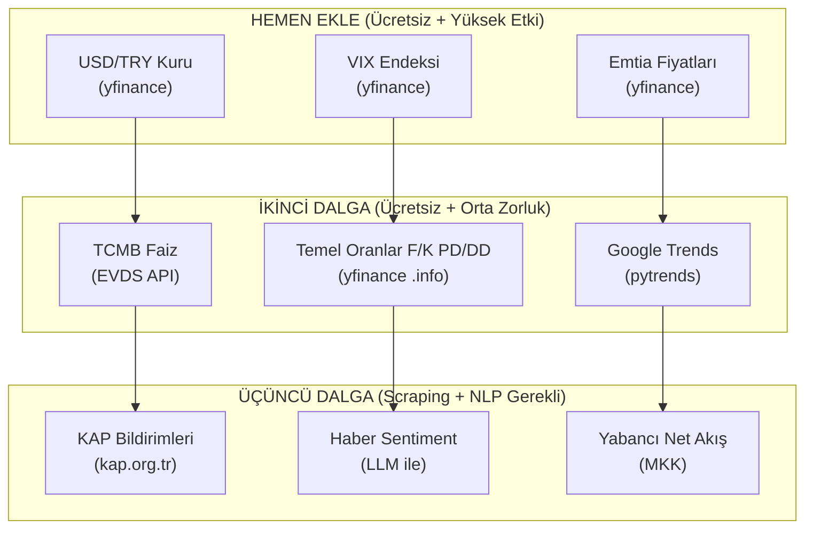

# BIST 100 Modeli İçin Ek Veri Kaynakları — Detaylı Rehber

Mevcut modelimiz sadece **fiyat ve hacim** verisinden türetilmiş 12 teknik gösterge kullanıyor. Quant finans literatüründe bu tür modellere **"price-volume only alpha"** denir ve prediktif güçleri sınırlıdır — çünkü piyasa bu bilgileri zaten fiyatlamıştır. Modelin alfa üretebilmesi için **piyasanın henüz tam fiyatlamadığı bilgi kaynaklarını** eklememiz gerekiyor.

Aşağıda 5 ana kategoride, en pratikten en karmaşığa doğru sıralanmış veri kaynaklarını detaylıca açıklıyorum.

---

## Kategori 1: Makroekonomik Veriler (Macro Factors)

Borsa İstanbul, gelişmekte olan bir piyasa olarak makro şoklara **aşırı duyarlıdır**. Faiz kararı, kur hareketi veya enflasyon sürprizi tek başına tüm endeksi %3-5 hareket ettirebilir.

### 1.1 TCMB Politika Faizi & Beklentileri

| | Detay |
|---|---|
| **Ne?** | Merkez Bankası'nın haftalık repo faiz oranı ve piyasa beklentisi |
| **Neden önemli?** | Faiz artışı → hisse senedi değerlemelerini düşürür (iskonto oranı artar). Faiz indirimi → tam tersi. Ama asıl sinyal **beklentiden sapma**dadır. |
| **Nereden?** | [TCMB EVDS API](https://evds2.tcmb.gov.tr/) — ücretsiz, Python ile çekilebilir |
| **Nasıl feature?** | `Policy_Rate`, `Rate_Change`, `Rate_Surprise` (gerçekleşen - beklenen) |
| **Prediktif güç** | ⭐⭐⭐⭐⭐ — BIST için en güçlü makro faktör |

### 1.2 USD/TRY Kur Dinamikleri

| | Detay |
|---|---|
| **Ne?** | Dolar/TL kuru, günlük değişimi ve volatilitesi |
| **Neden önemli?** | TL'nin değer kaybı ihracatçı hisseleri (THYAO, FROTO) pozitif, ithalatçıları (ARCLK) negatif etkiler. Ayrıca yabancı yatırımcı çıkışının proxy'sidir. |
| **Nereden?** | TCMB EVDS API veya `yfinance` (`USDTRY=X`) |
| **Nasıl feature?** | `FX_Log_Return`, `FX_Volatility_20`, `FX_SMA10_Ratio` |
| **Prediktif güç** | ⭐⭐⭐⭐⭐ — TL bazlı piyasa için kritik |

### 1.3 CDS Spread (Ülke Risk Primi)

| | Detay |
|---|---|
| **Ne?** | Türkiye'nin 5 yıllık CDS spreadi — ülkenin temerrüt riskinin piyasa fiyatlaması |
| **Neden önemli?** | CDS yükseldiğinde yabancı sermaye kaçar, BIST düşer. Korelasyon tarihsel olarak çok güçlü. |
| **Nereden?** | Bloomberg Terminal (ücretli) veya [Investing.com](https://www.investing.com/rates-bonds/turkey-cds-5-year-usd) scraping |
| **Nasıl feature?** | `CDS_Level`, `CDS_Change`, `CDS_Zscore_20` |
| **Prediktif güç** | ⭐⭐⭐⭐ — Özellikle kriz dönemlerinde çok güçlü |

### 1.4 Enflasyon (TÜFE) Sürpriz Faktörü

| | Detay |
|---|---|
| **Ne?** | Aylık TÜFE gerçekleşmesi vs piyasa beklentisi |
| **Neden önemli?** | Beklentiden yüksek enflasyon → faiz artış beklentisi → BIST baskılanır |
| **Nereden?** | TÜİK (aylık), beklentiler Reuters/Bloomberg anket |
| **Nasıl feature?** | `CPI_Surprise` = Gerçekleşen - Beklenen (aylık, ayın tüm günlerine broadcast) |
| **Prediktif güç** | ⭐⭐⭐ — Aylık frekansta olduğu için günlük modelde dolaylı etki |

---

## Kategori 2: Temel Analiz Verileri (Fundamental Data)

Fiyat/hacim modeli şirketin **ne iş yaptığını bilmez**. Temel analiz verileri modele "bu şirket ucuz mu pahalı mı?" sorusunu cevaplama kapasitesi kazandırır.

### 2.1 Finansal Oranlar (Valuation Multiples)

| | Detay |
|---|---|
| **Ne?** | F/K (Fiyat/Kazanç), PD/DD (Piyasa Değeri/Defter Değeri), Temettü Verimi |
| **Neden önemli?** | Düşük F/K hisseler uzun vadede outperform eder (value premium). Temel analiz sinyali, teknik analizden **bağımsız** bir alfa kaynağıdır. |
| **Nereden?** | `yfinance` `.info` dictionary (ücretsiz), [IsYatirim](https://www.isyatirim.com.tr/) veya [Finnet](https://finnet.gen.tr/) |
| **Nasıl feature?** | `PE_Ratio`, `PB_Ratio`, `Dividend_Yield`, `PE_Rank` (kesitsel sıralama) |
| **Prediktif güç** | ⭐⭐⭐⭐ — Uzun vadeli alfa, kısa vadede sınırlı |

```python
# Örnek: yfinance ile temel veri çekimi
import yfinance as yf
ticker = yf.Ticker("THYAO.IS")
info = ticker.info
pe_ratio = info.get("trailingPE")       # F/K oranı
pb_ratio = info.get("priceToBook")      # PD/DD oranı
div_yield = info.get("dividendYield")   # Temettü verimi
market_cap = info.get("marketCap")      # Piyasa değeri
```

### 2.2 Bilanço / Gelir Tablosu Büyüme Oranları

| | Detay |
|---|---|
| **Ne?** | Çeyreklik gelir büyümesi, net kar marjı değişimi, borç/özkaynak oranı |
| **Neden önemli?** | Kazanç büyümesi → hisse fiyatı yükselişi ilişkisi en temel finans prensibidir |
| **Nereden?** | `yfinance` `.quarterly_financials`, KAP açıklamaları, IsYatirim |
| **Nasıl feature?** | `Revenue_Growth_QoQ`, `Net_Margin_Change`, `Debt_Equity_Ratio` |
| **Prediktif güç** | ⭐⭐⭐ — Çeyreklik güncellenir, günlük modelde constant olarak yayılır |

---

## Kategori 3: Piyasa Sentiment ve Haber Analizi (NLP/LLM)

Bu kategori, mevcut projenin zaten **Faz 4'te planladığı** ama henüz uygulamadığı alandır. En yüksek marjinal alfa potansiyeli burada.

### 3.1 KAP Bildirimleri (Kamuyu Aydınlatma Platformu)

| | Detay |
|---|---|
| **Ne?** | Şirketlerin zorunlu olarak yayınladığı özel durum açıklamaları, bilanço, temettü, birleşme haberleri |
| **Neden önemli?** | KAP bildirimi sonrası hisseler sıklıkla tavan/taban yapar. Bu **event-driven alpha**'nın en temiz kaynağıdır. |
| **Nereden?** | [KAP.org.tr](https://www.kap.org.tr/) RSS feed veya web scraping |
| **Nasıl feature?** | LLM ile sentiment skoru: `KAP_Sentiment` ∈ [-1, +1], `KAP_Event_Type` (one-hot), `Days_Since_KAP` |
| **Prediktif güç** | ⭐⭐⭐⭐⭐ — En güçlü kısa vadeli sinyal kaynaklarından biri |

### 3.2 Finansal Haber Sentiment (Türkçe NLP)

| | Detay |
|---|---|
| **Ne?** | Bloomberg HT, Ekonomist, Dünya gazetesi gibi finansal haber kaynaklarından hisse bazlı sentiment |
| **Neden önemli?** | Pozitif haber akışı → kısa vadeli momentum. Negatif haber → satış baskısı. |
| **Nereden?** | RSS feedler, Google News API, veya direkt web scraping |
| **Nasıl feature?** | Gemini / GPT ile haber başlığını skorla: `News_Sentiment_Score`, `News_Volume` (haber yoğunluğu) |
| **Prediktif güç** | ⭐⭐⭐⭐ — Özellikle intraday ve T+1'de güçlü |

### 3.3 Sosyal Medya Sentiment (Twitter/X, Ekşi Sözlük)

| | Detay |
|---|---|
| **Ne?** | Bireysel yatırımcıların hisse hakkındaki sosyal medya paylaşımları |
| **Neden önemli?** | BIST'te bireysel yatırımcı ağırlığı yüksek. Sosyal medya hype'ı kısa vadeli fiyatı etkiler. |
| **Nereden?** | X (Twitter) API, Ekşi Sözlük scraping, StockTwits benzeri Türk platformları |
| **Nasıl feature?** | `Social_Sentiment`, `Social_Volume`, `Social_Sentiment_Change` |
| **Prediktif güç** | ⭐⭐⭐ — Gürültülü ama momentum sinyali olarak faydalı |

---

## Kategori 4: Piyasa Mikroyapısı ve Akış Verileri (Market Microstructure)

### 4.1 Yabancı Yatırımcı Net Alım/Satım

| | Detay |
|---|---|
| **Ne?** | Yabancı kurumsal yatırımcıların BIST'teki günlük net alım-satım tutarı |
| **Neden önemli?** | Yabancı çıkışı → BIST düşüşü ilişkisi Türkiye'de çok güçlü. Bu bilgi genelde fiyata 1-2 gün gecikmeli yansır. |
| **Nereden?** | [MKK (Merkezi Kayıt Kuruluşu)](https://www.mkk.com.tr/) verileri, TCMB portföy yatırımları |
| **Nasıl feature?** | `Foreign_Net_Flow`, `Foreign_Flow_5d_MA`, `Foreign_Flow_Zscore` |
| **Prediktif güç** | ⭐⭐⭐⭐⭐ — BIST'e özel en güçlü alfa kaynaklarından |

### 4.2 Açığa Satış ve Ödünç Pay Verileri

| | Detay |
|---|---|
| **Ne?** | Hisse bazlı açığa satış hacmi ve ödünç alınan pay miktarı |
| **Neden önemli?** | Yüksek açığa satış → piyasa profesyonellerinin düşüş beklentisinin göstergesi |
| **Nereden?** | Borsa İstanbul günlük bülten |
| **Nasıl feature?** | `Short_Interest_Ratio`, `Short_Interest_Change` |
| **Prediktif güç** | ⭐⭐⭐ — Contrarian sinyal olarak da kullanılabilir |

### 4.3 Opsiyon / VIX Benzeri Volatilite Endeksi

| | Detay |
|---|---|
| **Ne?** | VIX (ABD korku endeksi) veya BIST'e özgü volatilite göstergeleri |
| **Neden önemli?** | Global risk iştahı BIST'i doğrudan etkiler. VIX yükseldiğinde gelişmekte olan piyasalardan para çıkar. |
| **Nereden?** | `yfinance` (`^VIX`), CBOE |
| **Nasıl feature?** | `VIX_Level`, `VIX_Change`, `VIX_Above_25` (boolean risk flag) |
| **Prediktif güç** | ⭐⭐⭐⭐ — Global risk barometresi |

---

## Kategori 5: Alternatif Veri (Alternative Data)

### 5.1 Google Trends (Arama Hacmi)

| | Detay |
|---|---|
| **Ne?** | Hisse adının Google'da aranma sıklığındaki değişim |
| **Neden önemli?** | Arama hacmi artışı → bireysel yatırımcı ilgisi → kısa vadeli momentum (ve bazen dönüş noktası) |
| **Nereden?** | [pytrends](https://github.com/GeneralMills/pytrends) Python kütüphanesi (ücretsiz) |
| **Nasıl feature?** | `Search_Volume_Change`, `Search_Volume_Zscore` |
| **Prediktif güç** | ⭐⭐⭐ — Bireysel yatırımcı ağırlıklı BIST için faydalı |

### 5.2 Sektörel / Emtia Fiyatları

| | Detay |
|---|---|
| **Ne?** | Brent petrol, altın, bakır, demir cevheri, doğalgaz fiyatları |
| **Neden önemli?** | TUPRS → petrol, EREGL → demir, KOZAL → altın fiyatıyla doğrudan ilişkili. Sektörel döngü sinyali verir. |
| **Nereden?** | `yfinance` (`BZ=F`, `GC=F`, `HG=F`) |
| **Nasıl feature?** | `Oil_Return`, `Gold_Return`, `Copper_Return` + hisse-emtia etkileşim terimi |
| **Prediktif güç** | ⭐⭐⭐⭐ — Emtia bağımlı sektörler için çok güçlü |

---

## Öncelik Sıralaması: Ne İlk Eklenmeli?



> [!TIP]
> **İlk adım olarak USD/TRY, VIX ve emtia fiyatlarını eklemeni öneriyorum.** Hepsi `yfinance` ile tek satırda çekilebilir, mevcut pipeline'a kolayca entegre edilir ve BIST üzerinde kanıtlanmış prediktif güce sahiptir. Tek başına bu üç ekleme bile modelin sinyalini anlamlı şekilde güçlendirebilir.
